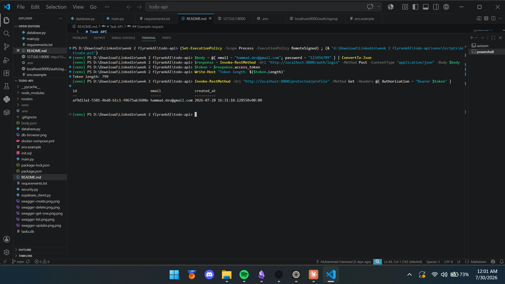

# Task API

Small CRUD API for a to-do list, built with **FastAPI**. Originally in-memory, then SQLite, now backed by **Postgres** running in Docker — data survives both app and container restarts.

**Week 4 update:** added **Supabase Auth** — sign up, log in, log out, and protected routes guarded by JWT verification, documented with the Swagger "Authorize" padlock. See the [Auth section](#auth--login--protect-week-4) below.

## Setup

1. Clone this repo and create a virtual environment:
   ```
   python -m venv venv
   venv\Scripts\activate      # Windows
   source venv/bin/activate   # macOS/Linux
   ```
2. Install dependencies:
   ```
   pip install -r requirements.txt
   ```
3. Copy `.env.example` to `.env` and fill in your real values (see below for both the database and Supabase credentials).
4. Start Postgres with Docker:
   ```
   docker compose up -d
   ```
5. Run the app:
   ```
   uvicorn main:app --reload --port 8000
   ```

Requires a `.env` file with `DATABASE_URL` and Supabase credentials set (see `.env.example`), a reachable Postgres instance, and a free Supabase project (see [Auth setup](#auth--login--protect-week-4) below).

Swagger docs are available at `http://localhost:8000/docs`.

## Endpoints

| Method | Path                 | Meaning                          | Auth header       |
|--------|----------------------|-----------------------------------|-------------------|
| GET    | /                    | API info                          | none               |
| GET    | /health              | Health check                      | none               |
| GET    | /tasks               | List all tasks                    | none               |
| GET    | /tasks/{id}          | Get a single task                 | none               |
| POST   | /tasks               | Create a new task                 | none               |
| PUT    | /tasks/{id}          | Update a task's title/done        | none               |
| DELETE | /tasks/{id}          | Delete a task                     | none               |
| POST   | /auth/signup         | Create a new user account         | none               |
| POST   | /auth/login          | Authenticate & return a JWT       | none               |
| POST   | /auth/logout         | End the user's session            | `Bearer <token>`   |
| GET    | /protected/profile   | Read private profile data         | `Bearer <token>`   |
| GET    | /protected/dashboard | Second protected route (demo)     | `Bearer <token>`   |
| GET    | /public/info         | Read public, open data            | none               |

## Database Browser screenshot (SQLite era, kept for history)


## Auth · Login & protect (Week 4)

Adds **Supabase Auth** as the Identity Provider: sign up, log in, log out, and JWT-guarded protected routes — layered on top of the existing app without touching the `/tasks` routes.

No password hashing or cryptography is written by hand — Supabase handles that. This code only ever sends credentials to Supabase and verifies the tokens it returns.

### Auth setup

1. Create a free project at [supabase.com](https://supabase.com).
2. In **Project Settings → API**, copy your **Project URL** and **anon key** (never the `service_role` key).
3. In **Authentication → Providers → Email**, turn **"Confirm email" off** for this practice project.
4. Add to your `.env` (see `.env.example`):
   ```
   SUPABASE_URL=your_project_url
   SUPABASE_KEY=your_anon_key
   ```
5. Install the new dependency (already in `requirements.txt`): `supabase`.
6. Run as usual: `uvicorn main:app --reload --port 8000`.

**Note on test accounts:** Supabase's free tier rate-limits outgoing emails. If you hit `"email rate limit exceeded"` while testing signup repeatedly, create test users directly from **Authentication → Users → Add user** in the Supabase dashboard instead (check "Auto Confirm User" so no email is needed).

### New files

```
supabase_client.py     # initializes the Supabase client from env vars
security.py            # get_current_user — the reusable guard (FastAPI dependency)
routers/
  auth.py               # /auth/signup, /auth/login, /auth/logout
  public.py             # /public/info
  protected.py          # /protected/profile, /protected/dashboard
```

### Testing the auth flow

**curl (macOS/Linux/Git Bash):**
```bash
# Sign up
curl -i -X POST http://localhost:8000/auth/signup \
  -H "Content-Type: application/json" \
  -d '{"email":"test@example.com","password":"password123"}'

# Log in
curl -i -X POST http://localhost:8000/auth/login \
  -H "Content-Type: application/json" \
  -d '{"email":"test@example.com","password":"password123"}'

# Call a protected route (paste your access_token)
curl -i http://localhost:8000/protected/profile \
  -H "Authorization: Bearer <PASTE_ACCESS_TOKEN>"

# Tamper with the token -> 401
curl -i http://localhost:8000/protected/profile \
  -H "Authorization: Bearer <PASTE_ACCESS_TOKEN>x"

# No token at all -> 401
curl -i http://localhost:8000/protected/profile
```

**PowerShell (Windows):**
```powershell
# Log in
$body = @{ email = "test@example.com"; password = "password123" } | ConvertTo-Json
$response = Invoke-RestMethod -Uri "http://localhost:8000/auth/login" -Method Post -ContentType "application/json" -Body $body
$token = $response.access_token

# Call a protected route
Invoke-RestMethod -Uri "http://localhost:8000/protected/profile" -Method Get -Headers @{ Authorization = "Bearer $token" }

# Tamper with the token -> 401
try {
    Invoke-RestMethod -Uri "http://localhost:8000/protected/profile" -Method Get -Headers @{ Authorization = "Bearer $($token)x" }
} catch {
    $_.Exception.Response.StatusCode
    $_.ErrorDetails.Message
}
```

### Swagger UI

FastAPI serves Swagger at `/docs` automatically. The `HTTPBearer` scheme in `security.py` makes the **Authorize** padlock appear on every protected route — paste a token once, then use "Try it out" directly in the browser.



*(Screenshot above shows the full flow verified end-to-end in the terminal: login → token retrieved → `/protected/profile` called with the token → real user data returned.)*

### Status codes

| Code | Meaning                          | When it happens                                   |
|------|-----------------------------------|----------------------------------------------------|
| 201  | Created                           | `/auth/signup` success                              |
| 200  | OK                                 | `/auth/login`, `/protected/*`, `/public/info` success |
| 204  | No Content                         | `/auth/logout` success                              |
| 400  | Bad Request                        | Missing email/password on signup or login           |
| 401  | Unauthorized                       | Missing, malformed, invalid, or expired token        |

### AI vs me (Stage 7)

_Write your own prompt from memory (don't copy this repo), generate a second version in `ai-version/`, run the same checkpoints against it, and answer:_

1. **Token extraction** — did the AI correctly parse the `Bearer ` prefix?
2. **Security flaws** — did it safely reject invalid tokens, or trust `get_user` without checking for exceptions/errors?
3. **What your prompt forgot to specify** — what did the AI silently decide for you?

## Stretch goals (optional)

- [ ] Add a real `403 Forbidden` case for an authenticated-but-not-allowed user, and document the `401` vs `403` difference.
- [ ] Add a `/auth/refresh` endpoint that exchanges a refresh token for a new access token.
- [ ] Rate-limit `POST /auth/login` and return `429` after N failed attempts.
